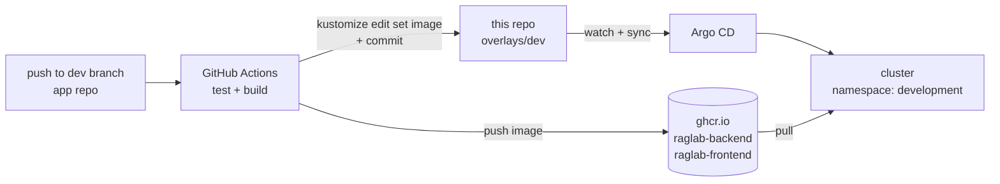

# RAG-Lab-Infra

GitOps repository for deploying [RAG Lab](https://github.com/Silverd087/RAG-Lab) to Kubernetes with **Argo CD**, **Kustomize**, and **Sealed Secrets**.

The application repo never touches the cluster: its CI builds images, pushes them to GHCR, and commits an image-tag bump here. Argo CD watches this repo and reconciles the cluster to whatever is committed.



## Repository structure

```
apps/
  rag-lab-dev.yaml          # Argo CD Application: overlays/dev → namespace development
base/                       # Kustomize base shared by all environments
  frontend/                 # Deployment + Service (nginx SPA)
  rag-service/              # Deployment + Service (FastAPI API)
  ingestion-service/        # Deployment (Celery worker, ingestion queue)
  evaluation-service/       # Deployment (Celery worker, evaluation queue)
  postgres/                 # StatefulSet + PVC + Service
  qdrant/                   # StatefulSet + PVC + Service
  minio/                    # StatefulSet + PVC + Service
  redis/                    # StatefulSet + PVC + Service
  rabbitmq/                 # StatefulSet + PVC + Service + ConfigMap
  configmap.yaml            # rag-common-config: non-secret env (hosts, bucket, users)
  ingress.yaml              # raglab.local → frontend (nginx ingress, 50m body, long timeouts for SSE)
  limitrange.yaml           # default resource limits for the namespace
overlays/
  dev/
    kustomization.yaml      # image tags (pinned by app-repo CI), namespace development
    namespace.yaml
    patches/                # e.g. rag-service replica count
    secrets/                # SealedSecrets (safe to commit) + kustomization
    app-secret.env          # local plaintext input for kubeseal (gitignored)
    infra-secret.env        # local plaintext input for kubeseal (gitignored)
  prod/
    kustomization.yaml      # namespace production, latest tags, secretGenerator
    hpa.yaml                # horizontal pod autoscaling
infrastructure/
  kustomization.yaml        # cluster add-ons: metrics-server, sealed-secrets controller
monitoring/
  prometheus/               # Deployment + PVC + scrape config
  grafana/                  # Deployment + PVC + Service
  celery-exporter/          # Celery → Prometheus metrics (broker creds via SealedSecret)
  ingress.yaml              # grafana.raglab.local, prometheus.raglab.local
  namespace.yaml            # namespace monitoring
```

## How deployments happen

1. A push to the app repo's `dev` branch (touching `backend/**` or `frontend/**`) runs tests, then builds and pushes `ghcr.io/silverd087/raglab-backend:sha-<short>` / `raglab-frontend:sha-<short>`.
2. The workflow checks out this repo (via a `DEPLOY_REPO_PAT`), runs `kustomize edit set image …` in `overlays/dev`, and commits — a `concurrency` group serializes the backend and frontend workflows so they don't race on the push.
3. Argo CD (Application `raglab-dev`, `apps/rag-lab-dev.yaml`) detects the commit and syncs `overlays/dev` into the `development` namespace.

**Rollback** = `git revert` the image-bump commit (or edit the tag in `overlays/dev/kustomization.yaml`) and let Argo CD sync.

## Setup

### Prerequisites

- A Kubernetes cluster — [minikube](https://minikube.sigs.k8s.io/docs/start/) works for local use
- [`kubectl`](https://kubernetes.io/docs/tasks/tools/#kubectl)
- [`kustomize`](https://kubectl.docs.kubernetes.io/installation/kustomize/) (a recent `kubectl` bundles it via `kubectl kustomize`/`kubectl apply -k`, but the standalone binary is needed for `kustomize edit`)
- [`kubeseal`](https://github.com/bitnami-labs/sealed-secrets#installation) — CLI for the Sealed Secrets controller, only needed if you'll rotate/add dev secrets
- An nginx ingress controller (`minikube addons enable ingress`)

### Clone the repo

```bash
git clone https://github.com/Silverd087/RAG-Lab-Infra.git
cd RAG-Lab-Infra
```

## Cluster bootstrap

```bash
# 1. Cluster add-ons: metrics-server + sealed-secrets controller
kubectl apply -k infrastructure/

# 2. Argo CD
kubectl create namespace argocd
kubectl apply -n argocd -f https://raw.githubusercontent.com/argoproj/argo-cd/stable/manifests/install.yaml

# 3. Register the dev application (creates the development namespace on sync)
kubectl apply -f apps/rag-lab-dev.yaml

# 4. Monitoring stack (optional)
kubectl apply -k monitoring/
```

Then map the ingress hosts (with minikube: `minikube ip`) in your hosts file:

```
<ingress-ip>  raglab.local grafana.raglab.local prometheus.raglab.local
```

The app is served at `http://raglab.local` (frontend proxies `/api/` to the rag-service in-cluster).

## Secrets

Runtime secrets are split in two, mounted into the backend services via `envFrom`:

| Secret | Contents |
|---|---|
| `rag-app-secret` | Provider API keys: `GOOGLE_API_KEY`, `ANTHROPIC_API_KEY`, `VOYAGE_API_KEY`, `COHERE_API_KEY` |
| `rag-infra-secret` | Datastore credentials: `POSTGRES_PASSWORD`, `MINIO_ROOT_PASSWORD`, `RABBITMQ_DEFAULT_PASS`, `RABBITMQ_URL`, … |

Non-secret configuration (hosts, ports, bucket name, usernames) lives in the `rag-common-config` ConfigMap in `base/`.

For **dev**, secrets are committed as [SealedSecrets](https://github.com/bitnami-labs/sealed-secrets) — encrypted against the controller's public key, decryptable only inside the cluster. To rotate or add one:

```bash
# 1. Edit the plaintext env file (gitignored — *.env never gets committed)
vim overlays/dev/app-secret.env

# 2. Generate a Secret and seal it
kubectl create secret generic rag-app-secret \
  --from-env-file=overlays/dev/app-secret.env \
  --namespace development --dry-run=client -o yaml \
| kubeseal --controller-namespace kube-system --format yaml \
> overlays/dev/secrets/sealed-app-secret.yaml

# 3. Commit the sealed file — Argo CD applies it, the controller unseals it
```

> Note: sealed secrets are encrypted for a specific cluster's controller key. A new cluster means resealing from the plaintext env files.

For **prod**, `kustomization.yaml` uses a `secretGenerator` reading `app-secret.env` / `infra-secret.env` — those files are gitignored and must be present at render time (i.e. prod is applied from a machine that has them, not from plain Argo CD sync).

## Environments

| | dev | prod |
|---|---|---|
| Namespace | `development` | `production` |
| Image tags | `sha-<short>`, pinned by app-repo CI on every `dev` push | `latest` (manual promotion) |
| Secrets | SealedSecrets, committed | `secretGenerator` from local env files |
| Scaling | Static replicas (patched per service) | HPA (needs metrics-server from `infrastructure/`) |
| Argo CD app | `apps/rag-lab-dev.yaml` | none yet — applied manually |

## Monitoring

The `monitoring/` kustomization deploys into its own namespace:

- **Prometheus** (`prometheus.raglab.local`) — scrapes the rag-service `/metrics` endpoint, MinIO (`MINIO_PROMETHEUS_AUTH_TYPE=public`), and the Celery exporter.
- **Grafana** (`grafana.raglab.local`) — dashboards over Prometheus; persisted via PVC.
- **celery-exporter** — translates Celery task/queue events from RabbitMQ into Prometheus metrics; broker credentials come from its own SealedSecret.

## Health probes

The backend exposes `GET /healthz` (liveness/startup) and `GET /readyz` (readiness — verifies Postgres, Qdrant, MinIO, Redis, and RabbitMQ connectivity and returns 503 with a per-dependency breakdown when degraded). The rag-service Deployment wires both as `startupProbe` and `readinessProbe`, so pods only receive traffic once every dependency is reachable.
